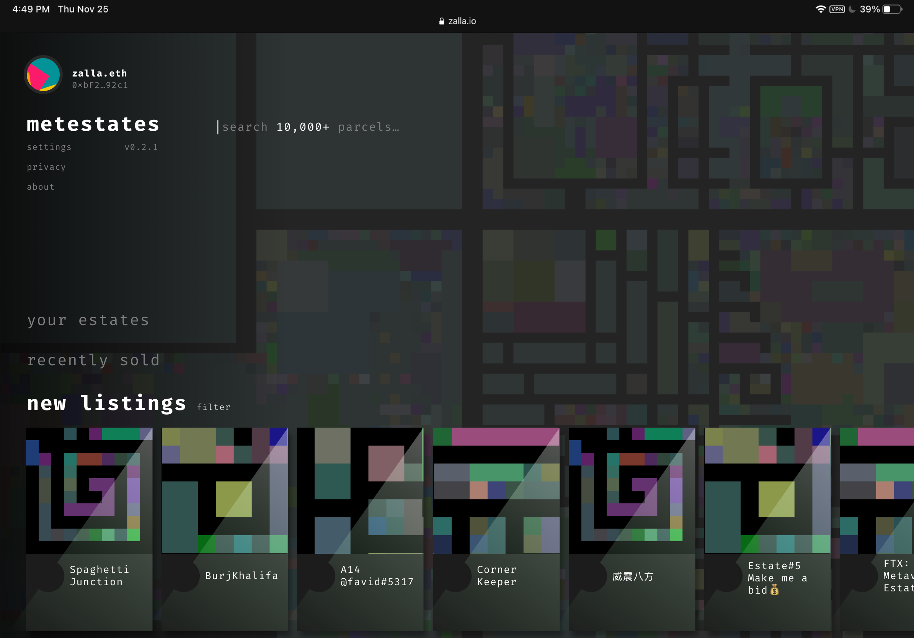

# Metestates

[](https://github.com/Metestates/metestates/actions/workflows/pages/pages-build-deployment)

The new digital land-rush is upon us! Will you become the next land-baron?



## Dependencies

```bash
$ npm i -g graphql apollo
changed 478 packages, and audited 479 packages in 16s

$ nvm use 16
Now using node v16.13.1 (npm v8.1.2)

$ node --version
v16.13.1

$ npm --version
8.1.2

$ npm list -g
~/.nvm/versions/node/v16.13.1/lib
├── apollo@2.33.9
├── corepack@0.10.0
├── graphql@16.1.0
└── npm@8.1.2
```

## Codegen

### Generate GraphQL JSON Schema

```bash
apollo client:download-schema ./marketplace.schema.json
```

### Generate GraphQL TypeScript interfaces

```bash
apollo codegen:generate \
    --localSchemaFile=./marketplace.schema.json \
	--target=typescript \
	--tagName=gql
```

## Available Scripts

In the project directory, you can run:

### `yarn start`

Runs the app in the development mode.\
Open [http://localhost:3000](http://localhost:3000) to view it in the browser.

The page will reload if you make edits.\
You will also see any lint errors in the console.

### `yarn test`

Launches the test runner in the interactive watch mode.\
See the section about [running tests](https://facebook.github.io/create-react-app/docs/running-tests) for more information.

### `yarn build`

Builds the app for production to the `build` folder.\
It correctly bundles React in production mode and optimizes the build for the best performance.

The build is minified and the filenames include the hashes.\
Your app is ready to be deployed!

See the section about [deployment](https://facebook.github.io/create-react-app/docs/deployment) for more information.
